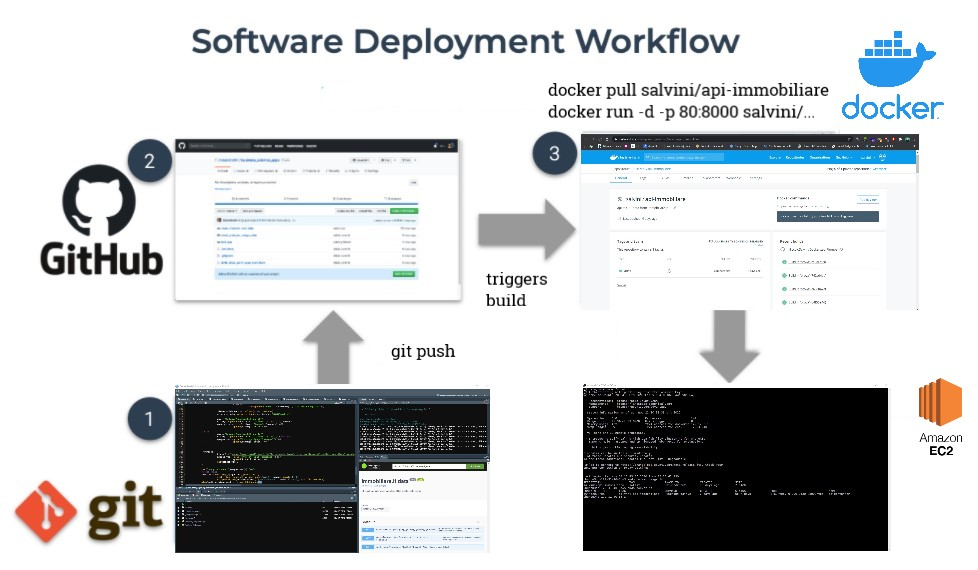
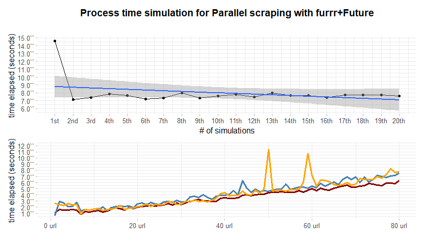
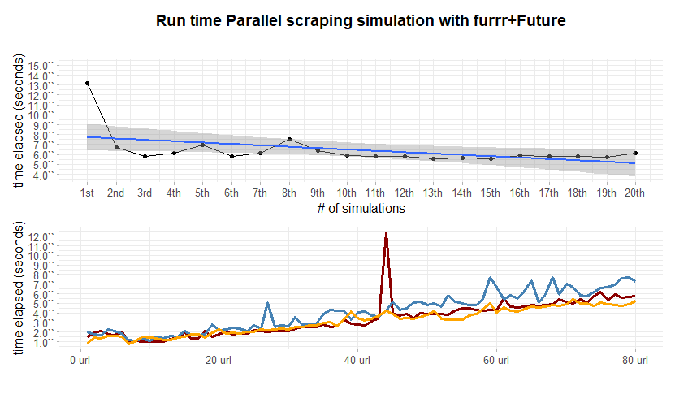

<!-- README.md is generated from README.Rmd. Please edit that file -->


```{r global.options, include=FALSE}
knitr::opts_chunk$set(
  warning = FALSE,  
  strip.white = TRUE,                 # if FALSE knitr will not remove white spaces at the beg or end
  fig.path = "img/",                  # file path to the directory DESTINATION where knitr shall store the
  fig.width=12,                       # the width for plots created by code chunk
  fig.height=8,                       # the height for plots created by code chunk
  cache = FALSE                       # if TRUE knitr will cache the results to reuse in future knits
)


knitr::knit_hooks$set(imgcenter = function(before, options, envir){  # to center image 
  if (before) {                                                      # add imgcenter = TRUE
    htmltools::HTML("<p align='center'>")                            # to the chunk options
  } else {
    htmltools::HTML("</p>")
  }
})
```


 
## Intro

[](https://GitHub.com/Naereen/StrapDown.js/graphs/commit-activity) <a href="https://www.buymeacoffee.com/gbraad" target="_blank"></a> [](https://shields.io/)


_author_: **[Niccolò Salvini](https://niccolosalvini.netlify.app/)**
_date_: Last update: `r format(Sys.Date(), "%d %B, %Y")`


<br> 

 
The following **REST API** provides a way to kindly collect [Immobiliare.it](https://www.immobiliare.it/) data from Real Estate rental and selling market over a various range of cities.
The API framework is R [**Plumber**](https://www.rplumber.io/) which calls **Parallelized** (multisession parallel back end)  [`furrr`](https://www.tidyverse.org/blog/2020/10/furrr-0-2-0/) ([`Future`](https://github.com/HenrikBengtsson/future)) scraping functions. The idea is to reverse engineer [immobiliare.it](https://www.immobiliare.it/) url semantic and then calling scraping functions on the targeted url. Plumber API framework decors scraping function codes allowing to be a RESTful endpoint. Code is then containerized with **Docker** and hosted in a **AWS EC2** server. **NGINX** load balances and authorizes traffic which is secured with **SSL** certificates allowing HTTPS.

**API URL**:

`15.161.14.100`

**SWAGGER UI FOR OAS3**

`15.161.14.100/__docs__/`

```{r infra, echo=FALSE, imgcenter = TRUE, fig.cap="sf development"}
 
```

## future improvements: 


- container orchestration with a scheduler `r emo::ji("time")`
- Mongodb ATLAS cluster connection `r emo::ji("time")`

<br><br>

## Parallel Benchmark

simulation conducted on `foreach` with `doMC` parallel back end vs `furrr` (`future` and  `purrr` Tidy evaluation) on local machine Microsoft Windows 10 Home	with Intel(R) Core(TM) i7-8750H CPU @ 2.20GHz, 2201 Mhz, 6 cores, 12 logical processors. On x axis the number of urls processed, on y axis run time:

```{r furrr, echo=FALSE, imgcenter = TRUE}
 
```

```{r foreach, echo=FALSE, imgcenter = TRUE, fig.cap="foreach + doFuture benchmark, errata corrige title"}
 
```
ù

## API Docs:  

- Get FAST real-time data, 6 predictors: title, price, num of rooms, sqmeter, primarykey, href
```r
      GET */fastscrape

      @param city [chr string] the city you are interested in (e.g. "roma", "milano", "firenze"--> lowercase, without accent) REQUIRED
      @param npages [positive integer] number of pages to scrape, default = 10, min  = 2, max = 300 REQUIRED
      @param type [chr string] "affitto" = rents, "vendita"  = sell REQUIRED
      @param thesis [boolean] TRUE for data used to perform thesis analysis REQUIRED
      @param macrozone [chr string] avail: Roma, Firenze, Milano, Torino; e.g. "fiera", "centro", "bellariva", "parioli" NOT REQUIRED
      content-type: application/json 
```
      
-  Get the complete set of covariates (52) from each single links, takes a while

```r
      GET */completescrape

      @param city [chr string] the city you are interested in (e.g. "roma", "milano", "firenze"--> lowercase, without accent) REQUIRED
      @param npages [positive integer] number of pages to scrape, default = 10, min  = 2, max = 300 REQUIRED
      @param type [chr string] "affitto" = rents, "vendita"  = sell REQUIRED
      @param thesis [boolean] TRUE for data used in thesis analysis REQUIRED
      @param macrozone [chr string] avail: Roma, Firenze, Milano, Torino; e.g. "fiera", "centro", "bellariva", "parioli" NOT REQUIRED
      content-type: application/json
            
```

## Query API calls Examples:

* **/ fastscrape** : _city = "milan", npages  = 10,  type =  "affitto", thesis = FALSE, macrozone = "fiera", "centro"_

`http://15.161.14.100/fastscrape/10/milano/affitto/false?macrozone=fiera&macrozone=centro`

    {
      "title": "Trilocale Parco delle Basiliche, Milano",
      "monthlyprice": "1200",
      "nroom": "3",
      "sqmeter": "80",
      "href": "https://www.immobiliare.it/annunci/84032066/"
    },
    {
      "title": "Monolocale via Morigi, Carrobbio, Milano",
      "monthlyprice": "1000",
      "nroom": "1",
      "sqmeter": "45",
      "href": "https://www.immobiliare.it/annunci/84029996/"
    },
    {
      "title": "Bilocale via Amedei, Carrobbio, Milano",
      "monthlyprice": "2080",
      "nroom": "2",
      "sqmeter": "90",
      "href": "https://www.immobiliare.it/annunci/84029006/"
    },
    .
    .
    .
 
* **/ fastscrape** :  _city = "firenze", npages  = 15,  type =  "vendita", thesis = FALSE_

`http://15.161.14.100/fastscrape/15/firenze/vendita/false`
    
    {
      "title": "Trilocale via Andrea del Sarto 65, Coverciano, Firenze",
      "monthlyprice": "245000",
      "nroom": "3",
      "sqmeter": "50",
      "href": "https://www.immobiliare.it/annunci/84030408/"
    },
    {
      "title": "Trilocale via dei Serragli 3, Santo Spirito, Firenze",
      "monthlyprice": "610000",
      "nroom": "3",
      "sqmeter": "110",
      "href": "https://www.immobiliare.it/annunci/84034600/"
    },
    {
      "title": "Bilocale via della Cernaia, Leopoldo - Vittorio Emanuele - Statuto, Firenze",
      "monthlyprice": "225000",
      "nroom": "2",
      "sqmeter": "56",
      "href": "https://www.immobiliare.it/annunci/84025152/"
    },
    .
    .
    .
    
    
-  **/ completescrape** : _npages  = 10, city = "milan", type =  "affitto", .thesis = FALSE_

  `http://15.161.14.100/completescrape/10/milano/affitto/false`
    
    {
      "ID": "83286087",
      "LAT": 45.4916,
      "LONG": 9.1617,
      "LOCATION": "via francesco caracciolo 63",
      "CONDOM": "145",
      "BUILDAGE": "1920",
      "FLOOR": "4° piano, con ascensore",
      "INDIVSAPT": "Appartamento",
      "LOCALI": "2 (1 camera da letto, 1 altro), 1 bagno, cucina angolo cottura",
      "STATUS": "Buono / Abitabile",
      "HEATING": "Centralizzato, a radiatori, alimentato a metano",
      "AC": "Autonomo, freddo",
      "PUB_DATE": "2020-10-13",
      "CATASTINFO": "Classe A/3, rendita € 343",
      "APTCHAR": "- - porta blindata- - - esposizione interna- - - armadio a muro- - - balcone- - - impianto tv singolo- - - arredato- - - infissi esterni in doppio vetro / pvc- -",
      "PHOTOSNUM": "20",
      "AGE": "Sigest S.p.A.",
      "CONTR": "Affitto",
      "TOTPIANI": "6 piani",
      "REVIEW": "All'interno di uno stabile signorile risalente ai primi anni del '900 e in ordine nelle parti comuni, proponiamo al piano quarto, un ampio bilocale con doppi balconi e silenzioso affaccio nel cortile interno. L'unità immobiliare è stata recentemente ristrutturata e si compone di ingresso, spazioso soggiorno con angolo cottura, camera da letto matrimoniale e bagno finestrato. L'appartamento viene consegnato completo di tutti gli arredi e aria condizionata in ogni ambiente. Posto bici all'interno del condominio. Lo stabile è inserito in un grande viale completamente alberato e in un contesto ricco di servizi - immediate vicinanze con M5 Cenisio e qualsivoglia mezzo di superficie di comodo collegamento con il centro.",
      "METRATURA": {
        "totalMainSurface": "52,0 m²",
        "constitution": "Abitazione",
        "floor": "4",
        "surface": "52,0 m²",
        "percentage": "100 %",
        "surfaceType": "Principale",
        "commercialSurface": "52,0 m²"
      },
      "HASMULTI": true,
      "LOWRDPRICE": {},
      "NROOMS": "2",
      "PRICE": "1000",
      "SQFEET": "52",
      "TITLE": "Bilocale via Francesco Caracciolo 63, Milano"
    },
    {
      "ID": "83288761",
      "LAT": 45.4728,
      "LONG": 9.2331,
      "LOCATION": "via inama 17",
      "CONDOM": "125",
      "BUILDAGE": "1985",
      "FLOOR": "1° piano, con ascensore",
      "INDIVSAPT": "Appartamento",
      "LOCALI": "3 (2 camere da letto, 1 altro), 1 bagno, cucina abitabile",
      "STATUS": "Ottimo / Ristrutturato",
      "HEATING": "Centralizzato, a radiatori, alimentato a gas",
      "AC": "Predisposizione impianto",
      "PUB_DATE": "2020-10-13",
      "CATASTINFO": "Classe A/3, rendita € 0",
      "APTCHAR": "- - cancello elettrico- - - fibra ottica- - - videocitofono- - - porta blindata- - - balcone- - - portiere intera giornata- - - impianto tv centralizzato- - - parzialmente arredato- - - infissi esterni in doppio vetro / metallo- - - esposizione doppia- -",
      "PHOTOSNUM": "20",
      "AGE": "IMMOBILIARE SANTALFREDO",
      "CONTR": "Affitto",
      "TOTPIANI": "5 piani",
      "REVIEW": "INTROVABILE APPENA RISTRUTTURATO, APPARTAMENTO TRILOCALE IN AFFITTO, CON ARREDO NUOVO.\nLa casa si trova in Via Inama, 17, Città Studi, all'interno di un bel palazzo, con servizio di portineria. \n L' appartamento è un trilocale con una metratura interna di 70 mq circa, composto da ingresso, cucina abitabile con disimpegno per lavatrice e lavabo, balconcino, due camere matrimoniali, bagno con doccia e utilissimo locale ripostiglio. \nLa casa viene locata con la cucina arredata, completa di elettrodomestici, tra cui la lavastoviglie e la lavatrice. Il bagno è completo di mobilio, specchio con luci, sanitari, doccia in cristallo e termo arredo. Due camere da letto, di cui una, sarà arredata con armadiature e letto matrimoniale. \nDETTAGLI: Ristrutturazione ultimata ad agosto 2020. Consegna del mobilio prevista a breve. Il riscaldamento è centralizzato; i serramenti hanno tutti i doppi vetri e l'apertura a vasistas, il serramento del bagno ha la basculante elettrica. L'esposizione dell' appartamento è doppia, in generale gode di una buona visuale e gli ambienti risultano essere piacevolmente luminosi e ben areati. \nSpese condominiali comprensive di riscaldamento, euro 1.500 /anno (prima della ristrutturazione). \nDesideri fissare un appuntamento o hai qualche domanda di approfondimento? Siamo disponibili al numero 0396908137 Immobiliare Santalfredo.",
      "METRATURA": {
        "totalMainSurface": "70,0 m²",    
        "constitution": "Abitazione",
        "floor": "1",
        "surface": "70,0 m²",
        "percentage": "100 %",
        "surfaceType": "Principale",
        "commercialSurface": "70,0 m²"
      },
      .
      .
      .

 
 