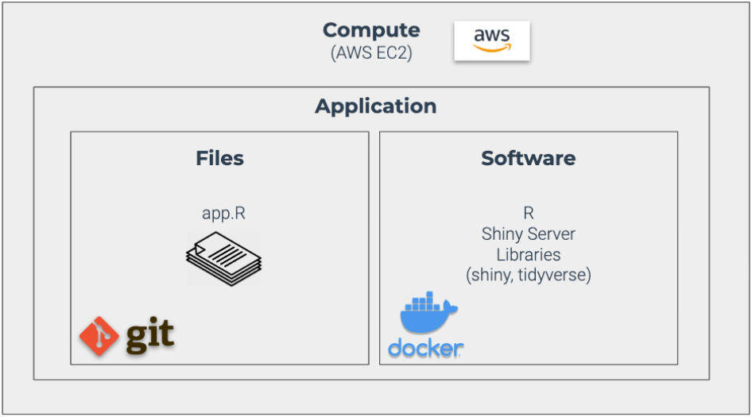

<!-- README.md is generated from README.Rmd. Please edit that file -->


```{r global.options, include=FALSE}
knitr::opts_chunk$set(
  warning = FALSE,  
  strip.white = TRUE,                 # if FALSE knitr will not remove white spaces at the beg or end
  fig.path = "img/",                  # file path to the directory DESTINATION where knitr shall store the
  fig.width=12,                       # the width for plots created by code chunk
  fig.height=8,                       # the height for plots created by code chunk
  cache = FALSE                       # if TRUE knitr will cache the results to reuse in future knits
)


knitr::knit_hooks$set(imgcenter = function(before, options, envir){  # to center image 
  if (before) {                                                      # add imgcenter = TRUE
    htmltools::HTML("<p align='center'>")                            # to the chunk options
  } else {
    htmltools::HTML("</p>")
  }
})
```


 
## API Infrastructure

[](https://GitHub.com/Naereen/StrapDown.js/graphs/commit-activity) <a href="https://www.buymeacoffee.com/gbraad" target="_blank"></a>


_author_: **[Niccolò Salvini](https://niccolosalvini.netlify.app/)**
_date_: Last update: `r format(Sys.Date(), "%d %B, %Y")`


<br> 

 
This **HTTP API** provides a way to scrape the public [Immobiliare.it](https://www.immobiliare.it/) database of Real Estate rental market. Plumber does not have in-built features to handle calls to the endpoints **Asynchronously**, as a matter of fact this is handled inside the `plumber.R` API body by the `foreach` package. Default @params provides the Real Estate rental Milan zone, nonetheless it is possible to specify the city, the number of webpages of interest and also the type as selling or rental market. get_data.R sources an API endpoint function to extract data from a predefined url (i.e. Milan rental real estate). Data is then sent to a Mongo ATLAS db. 
future improvements: 

- specification of the Macrozone and Microzone
- NGINX reverse proxy 
- Docker compose with a scheduler running behind 
- AWS EC2 server

API is built with `Plumber`, further documentation can be found [here](https://www.rplumber.io/index.html)

```{r infra, echo=FALSE, imgcenter = TRUE, fig.cap="infra"}
 
```


<br><br>


minimal reprex why `foreach` handles requests faster vs `furrr` (`future` spin-off). On x axis the number of urls processed, on y axis run time:

```{r furrr, echo=FALSE, imgcenter = TRUE, fig.cap="linear time big-O(n)"}
knitr::include_graphics("img/run_timefurrr.png") 
```

```{r foreach, echo=FALSE, imgcenter = TRUE, fig.cap="log time  big-O(log(n))"}
knitr::include_graphics("img/run_timeforeach.png") 
```


## API Docs:  

- Get FAST data, it covers 5 covariates: title, price, num of rooms, sqmeter, primarykey
```r
      GET */scrape

      @param city [chr string] the city you are interested in (e.g. "roma", "milano", "firenze"--> lowercase, without accent)
      @param npages [positive integer] number of pages to scrape, default = 10, min  = 2, max = 300
      @param type [chr string] "affitto" = rents, "vendita"  = sell 
      content-type: application/json 
```
- Get all the links 

```r
      GET */link

      @param city [chr string] the city you are interested to extract data (lowercase without accent)
      @param npages [positive integer] number of pages to scrape default = 10, min  = 2, max = 300
      @param type [chr string] "affitto" = rents, "vendita"  = sell 
      @param .thesis [logical] data used for master thesis
      content-type: application/json 
```   
      
-  Get the complete set of covariates (52) from each single links, takes a while

```r
      GET */complete

      @param city [chr string] the city you are interested to extract data (lowercase without accent)
      @param npages [positive integer] number of pages to scrape default = 10, min  = 2, max = 300
      @param type [chr string] "affitto" = rents, "vendita"  = sell 
      @param .thesis [logical] data used for master thesis
      content-type: application/json
            

```

 