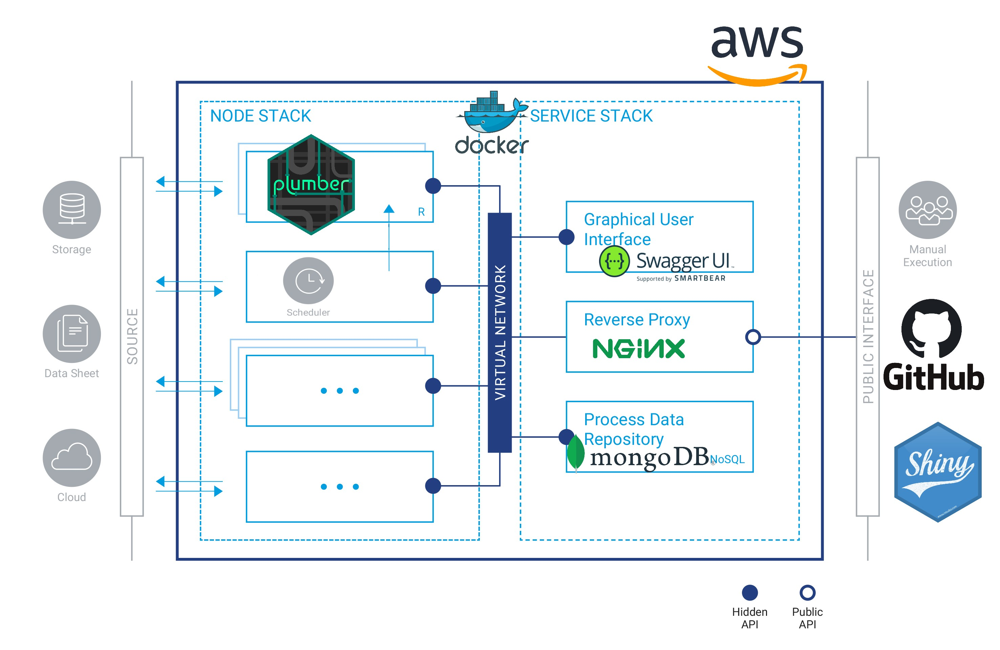
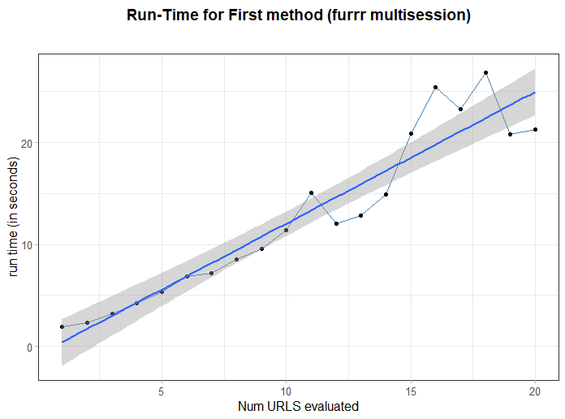
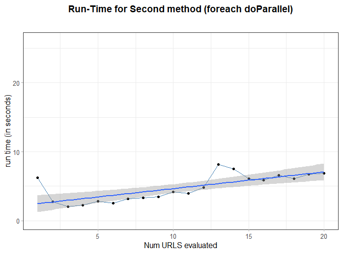

<!-- README.md is generated from README.Rmd. Please edit that file -->


```{r global.options, include=FALSE}
knitr::opts_chunk$set(
  warning = FALSE,  
  strip.white = TRUE,                 # if FALSE knitr will not remove white spaces at the beg or end
  fig.path = "img/",                  # file path to the directory DESTINATION where knitr shall store the
  fig.width=12,                       # the width for plots created by code chunk
  fig.height=8,                       # the height for plots created by code chunk
  cache = FALSE                       # if TRUE knitr will cache the results to reuse in future knits
)


knitr::knit_hooks$set(imgcenter = function(before, options, envir){  # to center image 
  if (before) {                                                      # add imgcenter = TRUE
    htmltools::HTML("<p align='center'>")                            # to the chunk options
  } else {
    htmltools::HTML("</p>")
  }
})
```


 
## REST API Infrastructure

[](https://GitHub.com/Naereen/StrapDown.js/graphs/commit-activity) <a href="https://www.buymeacoffee.com/gbraad" target="_blank"></a>


_author_: **[Niccolò Salvini](https://niccolosalvini.netlify.app/)**
_date_: Last update: `r format(Sys.Date(), "%d %B, %Y")`


<br> 

 
The follwing **REST API** provides a way to collect public [Immobiliare.it](https://www.immobiliare.it/) data for Real Estate rental market. Plumber endpoints calls **Parallel** and **Dockerized** scraping functions within the `foreach` %dopar%. Default @params provides the Real Estate rental Milan zone, nonetheless it is possible to specify the city, the number of webpages of interest as well as the market type as selling or rental market. */scrape endpoint exploits a shortest path shortcut in scraping leading to a very fast data gathering.
Moreover it has a further parameter macrozone that allows to select specific zone (NIL Nucleo Identità Locale) within the city, more details in the below documentation.
get_data.R sources an API endpoint function to extract data from a predefined url (i.e. Milan rental real estate). Data is then sent to a Mongo ATLAS db ( _in itinere_). The system is hosted on AWS Ec2 instance free tier, please try not to send too many requests, this is open sourced and on completely on me. Feel free to leave a tip if you enjoined it!

**QUERY URL**:

`ec2-15-161-94-121.eu-south-1.compute.amazonaws.com`    


future improvements: 

- NGINX reverse proxy 
- Docker compose with a scheduler running behind 

The API framework is the R `Plumber`, further documentation can be found at its dedicated [website](https://www.rplumber.io/index.html). A sketch of the infrastructure below

```{r infra, echo=FALSE, imgcenter = TRUE, fig.cap="infra"}
 
```


<br><br>


minimal reprex why `foreach` handles requests faster vs `furrr` (`future` spin-off). On x axis the number of urls processed, on y axis run time:

```{r furrr, echo=FALSE, imgcenter = TRUE, fig.cap="linear time big-O(n)"}
 
```

```{r foreach, echo=FALSE, imgcenter = TRUE, fig.cap="log time  big-O(log(n))"}
 
```


## API Docs:  

- Get FAST data, it covers 5 covariates: title, price, num of rooms, sqmeter, primarykey
```r
      GET */scrape

      @param city [chr string] the city you are interested in (e.g. "roma", "milano", "firenze"--> lowercase, without accent)
      @param npages [positive integer] number of pages to scrape, default = 10, min  = 2, max = 300
      @param type [chr string] "affitto" = rents, "vendita"  = sell
      @param macrozone [chr string] avail: Roma, Firenze, Milano, Torino; e.g. "fiera", "centro", "bellariva", "parioli" 
      content-type: application/json 
```
- Get all the links 

```r
      GET */link

      @param city [chr string] the city you are interested to extract data (lowercase without accent)
      @param npages [positive integer] number of pages to scrape default = 10, min  = 2, max = 300
      @param type [chr string] "affitto" = rents, "vendita"  = sell 
      @param .thesis [logical] data used for master thesis
      content-type: application/json 
```   
      
-  Get the complete set of covariates (52) from each single links, takes a while

```r
      GET */complete

      @param city [chr string] the city you are interested to extract data (lowercase without accent)
      @param npages [positive integer] number of pages to scrape default = 10, min  = 2, max = 300
      @param type [chr string] "affitto" = rents, "vendita"  = sell 
      @param .thesis [logical] data used for master thesis
      content-type: application/json
            
```

## Query calls Examples:
__on default localhost: 127.0.0.1 and port: 9801__

* **/ scrape** : _npages  = 10, city = "milan", type =  "affitto", macrozone = "fiera", "centro"_

`http://127.0.0.1:9801/scrape/10/milano/affitto?macrozone=fiera&macrozone=centro`

    {
      "TITLE": "Bilocale via Broletto, Duomo, Milano",
      "MONTHLYPRICE": "1900",
      "NROOM": "2",
      "SQMETER": "60",
      "PRIMARYKEY": 83286395
    },
    {
      "TITLE": "Quadrilocale via Ponte Vetero, Cadorna - Castello, Milano",
      "MONTHLYPRICE": "8350",
      "NROOM": "4",
      "SQMETER": "Not Found",
      "PRIMARYKEY": 83286545
    },
    {
      "TITLE": "Bilocale via Pantano, Missori, Milano",
      "MONTHLYPRICE": "2000",
      "NROOM": "2",
      "SQMETER": "110",
      "PRIMARYKEY": 83286083
    }
    .
    .
    .
 
* **/ scrape** : _npages  = 10, city = "milan", type =  "affitto"_

`http://127.0.0.1:9801/scrape/10/milano/affitto`
    
    {
      "TITLE": "Bilocale via Francesco Caracciolo 63, Ghisolfa - Mac Mahon, Milano",
      "MONTHLYPRICE": "1000",
      "NROOM": "2",
      "SQMETER": "52",
      "PRIMARYKEY": 83286087
    },
    {
      "TITLE": "Trilocale via Inama 17, Città Studi, Milano",
      "MONTHLYPRICE": "1500",
      "NROOM": "3",
      "SQMETER": "70",
      "PRIMARYKEY": 83288761
    },
    {
      "TITLE": "Bilocale via Gargano, Ripamonti, Milano",
      "MONTHLYPRICE": "950",
      "NROOM": "2",
      "SQMETER": "50",
      "PRIMARYKEY": 83289431
    },
    .
    .
    .
    
    
-  **/ complete** : _npages  = 10, city = "milan", type =  "affitto", .thesis = FALSE_

  `http://127.0.0.1:9801/complete/10/milano/affitto/false`
    
    {
      "ID": "83286087",
      "LAT": 45.4916,
      "LONG": 9.1617,
      "LOCATION": "via francesco caracciolo 63",
      "CONDOM": "145",
      "BUILDAGE": "1920",
      "FLOOR": "4° piano, con ascensore",
      "INDIVSAPT": "Appartamento",
      "LOCALI": "2 (1 camera da letto, 1 altro), 1 bagno, cucina angolo cottura",
      "STATUS": "Buono / Abitabile",
      "HEATING": "Centralizzato, a radiatori, alimentato a metano",
      "AC": "Autonomo, freddo",
      "PUB_DATE": "2020-10-13",
      "CATASTINFO": "Classe A/3, rendita € 343",
      "APTCHAR": "- - porta blindata- - - esposizione interna- - - armadio a muro- - - balcone- - - impianto tv singolo- - - arredato- - - infissi esterni in doppio vetro / pvc- -",
      "PHOTOSNUM": "20",
      "AGE": "Sigest S.p.A.",
      "CONTR": "Affitto",
      "TOTPIANI": "6 piani",
      "REVIEW": "All'interno di uno stabile signorile risalente ai primi anni del '900 e in ordine nelle parti comuni, proponiamo al piano quarto, un ampio bilocale con doppi balconi e silenzioso affaccio nel cortile interno. L'unità immobiliare è stata recentemente ristrutturata e si compone di ingresso, spazioso soggiorno con angolo cottura, camera da letto matrimoniale e bagno finestrato. L'appartamento viene consegnato completo di tutti gli arredi e aria condizionata in ogni ambiente. Posto bici all'interno del condominio. Lo stabile è inserito in un grande viale completamente alberato e in un contesto ricco di servizi - immediate vicinanze con M5 Cenisio e qualsivoglia mezzo di superficie di comodo collegamento con il centro.",
      "METRATURA": {
        "totalMainSurface": "52,0 m²",
        "constitution": "Abitazione",
        "floor": "4",
        "surface": "52,0 m²",
        "percentage": "100 %",
        "surfaceType": "Principale",
        "commercialSurface": "52,0 m²"
      },
      "HASMULTI": true,
      "LOWRDPRICE": {},
      "NROOMS": "2",
      "PRICE": "1000",
      "SQFEET": "52",
      "TITLE": "Bilocale via Francesco Caracciolo 63, Milano"
    },
    {
      "ID": "83288761",
      "LAT": 45.4728,
      "LONG": 9.2331,
      "LOCATION": "via inama 17",
      "CONDOM": "125",
      "BUILDAGE": "1985",
      "FLOOR": "1° piano, con ascensore",
      "INDIVSAPT": "Appartamento",
      "LOCALI": "3 (2 camere da letto, 1 altro), 1 bagno, cucina abitabile",
      "STATUS": "Ottimo / Ristrutturato",
      "HEATING": "Centralizzato, a radiatori, alimentato a gas",
      "AC": "Predisposizione impianto",
      "PUB_DATE": "2020-10-13",
      "CATASTINFO": "Classe A/3, rendita € 0",
      "APTCHAR": "- - cancello elettrico- - - fibra ottica- - - videocitofono- - - porta blindata- - - balcone- - - portiere intera giornata- - - impianto tv centralizzato- - - parzialmente arredato- - - infissi esterni in doppio vetro / metallo- - - esposizione doppia- -",
      "PHOTOSNUM": "20",
      "AGE": "IMMOBILIARE SANTALFREDO",
      "CONTR": "Affitto",
      "TOTPIANI": "5 piani",
      "REVIEW": "INTROVABILE APPENA RISTRUTTURATO, APPARTAMENTO TRILOCALE IN AFFITTO, CON ARREDO NUOVO.\nLa casa si trova in Via Inama, 17, Città Studi, all'interno di un bel palazzo, con servizio di portineria. \n L' appartamento è un trilocale con una metratura interna di 70 mq circa, composto da ingresso, cucina abitabile con disimpegno per lavatrice e lavabo, balconcino, due camere matrimoniali, bagno con doccia e utilissimo locale ripostiglio. \nLa casa viene locata con la cucina arredata, completa di elettrodomestici, tra cui la lavastoviglie e la lavatrice. Il bagno è completo di mobilio, specchio con luci, sanitari, doccia in cristallo e termo arredo. Due camere da letto, di cui una, sarà arredata con armadiature e letto matrimoniale. \nDETTAGLI: Ristrutturazione ultimata ad agosto 2020. Consegna del mobilio prevista a breve. Il riscaldamento è centralizzato; i serramenti hanno tutti i doppi vetri e l'apertura a vasistas, il serramento del bagno ha la basculante elettrica. L'esposizione dell' appartamento è doppia, in generale gode di una buona visuale e gli ambienti risultano essere piacevolmente luminosi e ben areati. \nSpese condominiali comprensive di riscaldamento, euro 1.500 /anno (prima della ristrutturazione). \nDesideri fissare un appuntamento o hai qualche domanda di approfondimento? Siamo disponibili al numero 0396908137 Immobiliare Santalfredo.",
      "METRATURA": {
        "totalMainSurface": "70,0 m²",    
        "constitution": "Abitazione",
        "floor": "1",
        "surface": "70,0 m²",
        "percentage": "100 %",
        "surfaceType": "Principale",
        "commercialSurface": "70,0 m²"
      },
      .
      .
      .

 
 