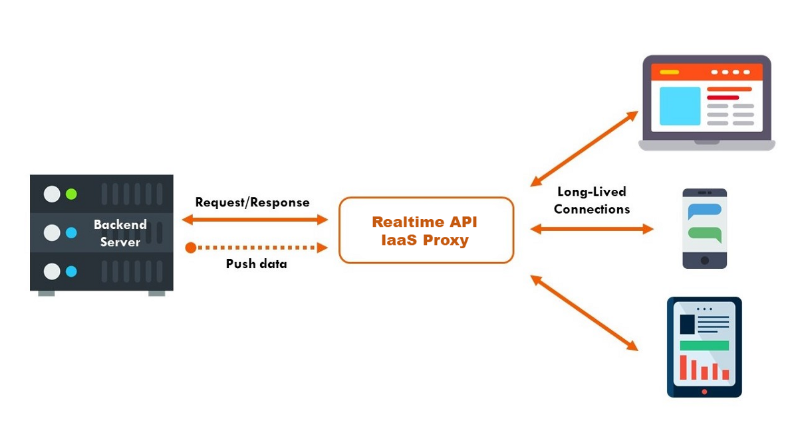

<!-- README.md is generated from README.Rmd. Please edit that file -->


```{r global.options, include=FALSE}
knitr::opts_chunk$set(
  warning = FALSE,  
  strip.white = TRUE,                 # if FALSE knitr will not remove white spaces at the beg or end
  fig.path = "img/",                  # file path to the directory DESTINATION where knitr shall store the
  fig.width=12,                       # the width for plots created by code chunk
  fig.height=8,                       # the height for plots created by code chunk
  cache = FALSE                       # if TRUE knitr will cache the results to reuse in future knits
)


knitr::knit_hooks$set(imgcenter = function(before, options, envir){  # to center image 
  if (before) {                                                      # add imgcenter = TRUE
    htmltools::HTML("<p align='center'>")                            # to the chunk options
  } else {
    htmltools::HTML("</p>")
  }
})
```


 
# API docs

_author_: **[Niccolò Salvini](https://niccolosalvini.netlify.app/)**
_date_: `r format(Sys.Date(), "%d %B, %Y")`


<br> <br> 


```{r FIRENZE, echo=FALSE, imgcenter = TRUE, fig.cap = "API infrastructure", fig.retina=1}
 
```

This project is described in detail in the corresponding blog post series:
  
**Part I:** https://medium.com/analytics-vidhya/google-big-query-with-r-875facef7844 <p>
**Part II:** https://medium.com/analytics-vidhya/live-data-extraction-with-cron-and-r-f29324bf153e <p>
**Part III:** https://medium.com/analytics-vidhya/easy-api-building-for-data-scientists-with-r-673b381c4ae1


# Dockerized Plumber API

These REST APIs provide a way for platform/language independent access to the public Google Big Query dataset  `bigquery-public-data:openaq.global_air_quality` of air pollution measured soley at Indian measurement points. The dataset is updated daily, however older data seem to get deleted. To access this data a Cron job fetches new data in 12 hour intervals from Google through the R script `get_data_big_query.R` and adds new rows to the saved dataset. The data can be requested fully or aggregated on date intervals through the APIs provided in the Rscript `API.R`. The data import via Cron and the APIs are run seperately in two Docker containers with a shared volume for the data as specified in the `docker-compose.yml`.<br><br> The APIs for Cloud Storage and Big Query have to be activated first for the used Google account at https://console.cloud.google.com/ and a Service Account Token (here not included, should go in cron/src/) needs to be generated and downloaded for authentification as described in section "Service account token" at https://gargle.r-lib.org/articles/get-api-credentials.html. For information about the r package `bigrquery`  see https://github.com/r-dbi/bigrquery. 


## API Documentation:  

- Get complete data from all Indian measurement points   

      POST */all

      NO parameters
      content-type: application/json 

- Get all Indian measurement locations 

       POST */locations

      NO parameters
      content-type: application/json  

- Get median airquality metrics of the current date with date horizon for averaging at measurement location.

      POST */summed_quality_now?measurment_location=&date=

      measurment_location: Takes all values from the Indian measurement locations, defaults to all
      date: The daterange, takes either today, week, month, quarter, year, defaults to today
      content-type: application/json   
      

- Get median air quality for all dates. The timerange for averaging and the measurement location can be set. 

      POST */summed_quality?measurment_location=&date=

      measurment_location: Takes all values from the Indian measurement locations, defaults to all
      date: The daterange, takes either day, week, month, quarter, year, defaults to day
      content-type: application/json  


- Plot a test histogram

      GET */plot

      NO parameters
      content-type: application/json  
