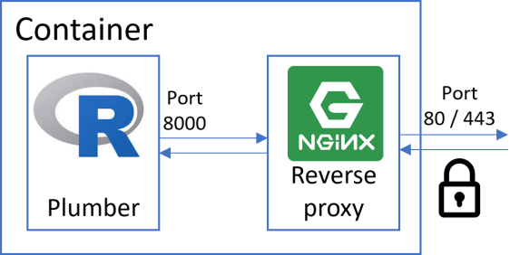

Dockerized API Scraping [Immobiliare.it](https://www.immobiliare.it/)
================

  - [API Infrastructure](#api-infrastructure)
  - [API Documentation:](#api-documentation)

<!-- README.md is generated from README.Rmd. Please edit that file -->

x


## API Infrastructure

[](https://GitHub.com/Naereen/StrapDown.js/graphs/commit-activity)
<a href="https://www.buymeacoffee.com/gbraad" target="_blank"></a>

*author*: **[Niccolò Salvini](https://niccolosalvini.netlify.app/)**
*date*: 22 settembre, 2020

<br>

This **REST API** provides a way for platform/language independent
access to the public [Immobiliare.it](https://www.immobiliare.it/)
database of Real Estate rental market. By default it provides to the
scraping functions the corrisponding Milan url connected to its Real
Estate market, it will be possible for sure to provide only the city
information in the very next future. It can be extended also for other
cities by providing different urls. API are managed by `Plumber` which
is a R framework to build APIs. They are containerized in a Docker
container which will be hosted on AWS EC2 server. On top of that each
day a scheduler runs scraping functions and store daily data on a DB
that can be queried by this API ( *in itinere* ): <br><br>

<p align="center">



</p>

## API Documentation:

  - Get fast raw data, 5 covariates: title, price, num of rooms,
    sqmeter, primarykey

<!-- end list -->

``` r
      GET */scrape

      param url _string_ the category link from which you are interested to extract data
      param npages _positive integer_ number of pages to be scrapped starting from page 1 
      content-type: application/json 
```

  - Get all the links

<!-- end list -->

``` r
      GET */link

      param url _string_  the category link from which you are interested to extract data
      param npages  _positive integer_  num of pages you are interested in
      content-type: application/json 
```

  - Get the complete data from single links (not the raw)

<!-- end list -->

``` r

      GET */complete

      param _string_ url you you want to extract info from
      param npages _positive integer_  num of pages you are interested starting from the url param
      content-type: application/json
            
```
