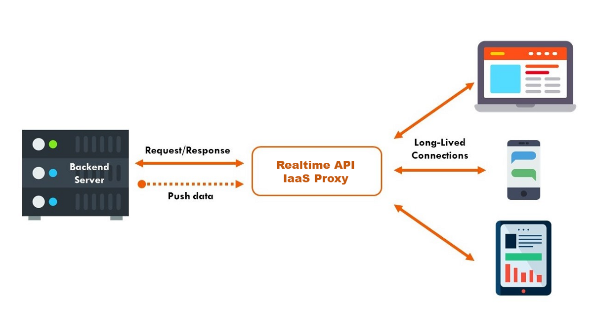

Dockerized API Scraping [Immobiliare.it](https://www.immobiliare.it/)
================

  - [API Infrastructure](#api-infrastructure)
      - [API Documentation:](#api-documentation)

<!-- README.md is generated from README.Rmd. Please edit that file -->

# API Infrastructure

*author*: **[Niccolò Salvini](https://niccolosalvini.netlify.app/)**
*date*: 03 settembre, 2020

   

These REST APIs provide a way for platform/language independent access
to the public [Immobiliare.it](https://www.immobiliare.it/) dataset of
real estate rental market. The dataset is going to be updated daily,
some of the entries can be deleted and replaced by some other. In order
to keep track to changes in the dataset I strongly suggest to store the
daily meausuraments and then merge them. In the final stage of the API
building Th user can access this data and a scheduler job fetches new
data in 12 hour intervals from Immobiliare through the R script
`plumber.R` and adds new rows to the saved dataset (not implemented
yet). The data comes in a json format and by the parameter npages can be
selected the number of pages the user needs to scrap. The data import
via Cron and the APIs are run seperately in two Docker containers with a
shared volume for the data as specified in the
`docker-compose.yml`.  

## API Documentation:

  - Get complete data from all Indian measurement points
    
        GET */scrapecat
        
        param npages number of pages that are going to be scraped
        content-type: application/json 

  - Get all Indian measurement locations
    
        GET */scrapelink
        
        param nlink number of link that are going to be scraped
        content-type: application/json
