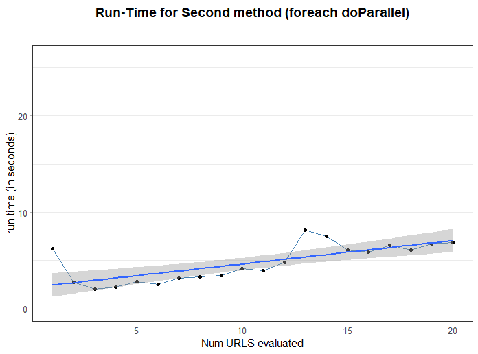

REST API Scraping for [Immobiliare.it](https://www.immobiliare.it/)
================

  - [REST API Infrastructure](#rest-api-infrastructure)
  - [API Docs:](#api-docs)
  - [Query API calls Examples:](#query-api-calls-examples)

<!-- README.md is generated from README.Rmd. Please edit that file -->


## REST API Infrastructure

[](https://GitHub.com/Naereen/StrapDown.js/graphs/commit-activity)
<a href="https://www.buymeacoffee.com/gbraad" target="_blank"></a>
<svg xmlns="http://www.w3.org/2000/svg" xmlns:xlink="http://www.w3.org/1999/xlink" width="90" height="20"><linearGradient id="b" x2="0" y2="100%"><stop offset="0" stop-color="#bbb" stop-opacity=".1"/><stop offset="1" stop-opacity=".1"/></linearGradient><clipPath id="a"><rect width="90" height="20" rx="3" fill="#fff"/></clipPath><g clip-path="url(#a)"><path fill="#555" d="M0 0h37v20H0z"/><path fill="#97CA00" d="M37 0h53v20H37z"/><path fill="url(#b)" d="M0 0h90v20H0z"/></g><g fill="#fff" text-anchor="middle" font-family="DejaVu Sans,Verdana,Geneva,sans-serif" font-size="110">
<text x="195" y="150" fill="#010101" fill-opacity=".3" transform="scale(.1)" textLength="270">build</text><text x="195" y="140" transform="scale(.1)" textLength="270">build</text><text x="625" y="150" fill="#010101" fill-opacity=".3" transform="scale(.1)" textLength="430">success</text><text x="625" y="140" transform="scale(.1)" textLength="430">success</text></g>
</svg>

*author*: **[Niccolò Salvini](https://niccolosalvini.netlify.app/)**
*date*: Last update: 17 novembre, 2020

<br>

The follwing **REST API** provides a way to collect public
[Immobiliare.it](https://www.immobiliare.it/) data for Real Estate
rental market. Plumber endpoints calls **Parallel** and **Dockerized**
scraping functions within the `foreach` %dopar%. Default @params
provides the Real Estate rental Milan zone, nonetheless it is possible
to specify the city, the number of webpages of interest as well as the
market type as selling or rental market. \*/scrape endpoint exploits a
shortest path shortcut in scraping leading to a very fast data
gathering. Moreover it has a further parameter macrozone that allows to
select specific zone (NIL Nucleo Identità Locale) within the city, more
details in the below documentation. get\_data.R sources an API endpoint
function to extract data from a predefined url (i.e. Milan rental real
estate). Data is then sent to a Mongo ATLAS db ( *in itinere*). The
system is hosted on AWS Ec2 instance free tier, please try not to send
too many requests, this is open sourced and on completely on me. Feel
free to leave a tip if you enjoined it\!

**API URL**:

`ec2-15-161-94-121.eu-south-1.compute.amazonaws.com`

**SWAGGER UI FOR EASY API COMPLETION**

`ec2-15-161-94-121.eu-south-1.compute.amazonaws.com/__docs__/`

future improvements:

  - NGINX reverse proxy
  - Docker compose with a scheduler running behind
  - HTTPS security

The API framework is the R `Plumber`, further documentation can be found
at its dedicated [website](https://www.rplumber.io/index.html). A sketch
of the infrastructure below

<p align="center">

<div class="figure">


<p class="caption">

infra

</p>

</div>

</p>

<br><br>

simulation conduced on `foreach` parallel scraping faster vs `furrr`
(`future` and `purrr` Tidy evaluation). On x axis the number of urls
processed, on y axis run time:

<p align="center">

<div class="figure">


<p class="caption">

linear time big-O(n)

</p>

</div>

</p>

<p align="center">

<div class="figure">



<p class="caption">

log time big-O(log(n))

</p>

</div>

</p>

## API Docs:

  - Get FAST real-time data, 6 predictors: title, price, num of rooms,
    sqmeter, primarykey, href

<!-- end list -->

``` r
      GET */fastscrape

      @param city [chr string] the city you are interested in (e.g. "roma", "milano", "firenze"--> lowercase, without accent) REQUIRED
      @param npages [positive integer] number of pages to scrape, default = 10, min  = 2, max = 300 REQUIRED
      @param type [chr string] "affitto" = rents, "vendita"  = sell REQUIRED
      @param thesis [boolean] TRUE for data used to perform thesis analysis REQUIRED
      @param macrozone [chr string] avail: Roma, Firenze, Milano, Torino; e.g. "fiera", "centro", "bellariva", "parioli" NOT REQUIRED
      content-type: application/json 
```

  - Get the complete set of covariates (52) from each single links,
    takes a while

<!-- end list -->

``` r
      GET */completescrape

      @param city [chr string] the city you are interested in (e.g. "roma", "milano", "firenze"--> lowercase, without accent) REQUIRED
      @param npages [positive integer] number of pages to scrape, default = 10, min  = 2, max = 300 REQUIRED
      @param type [chr string] "affitto" = rents, "vendita"  = sell REQUIRED
      @param thesis [boolean] TRUE for data used in thesis analysis REQUIRED
      @param macrozone [chr string] avail: Roma, Firenze, Milano, Torino; e.g. "fiera", "centro", "bellariva", "parioli" NOT REQUIRED
      content-type: application/json
            
```

## Query API calls Examples:

**on default localhost: 127.0.0.1 and port: 8000 (plumber default is
9801)**

  - **/ fastscrape** : *city = “milan”, npages = 10, type = “affitto”,
    thesis = FALSE, macrozone = “fiera”, “centro”*

`http://127.0.0.1:8000/fastscrape/10/milano/affitto/false?macrozone=fiera&macrozone=centro`

    {
      "title": "Trilocale Parco delle Basiliche, Milano",
      "monthlyprice": "1200",
      "nroom": "3",
      "sqmeter": "80",
      "href": "https://www.immobiliare.it/annunci/84032066/"
    },
    {
      "title": "Monolocale via Morigi, Carrobbio, Milano",
      "monthlyprice": "1000",
      "nroom": "1",
      "sqmeter": "45",
      "href": "https://www.immobiliare.it/annunci/84029996/"
    },
    {
      "title": "Bilocale via Amedei, Carrobbio, Milano",
      "monthlyprice": "2080",
      "nroom": "2",
      "sqmeter": "90",
      "href": "https://www.immobiliare.it/annunci/84029006/"
    },
    .
    .
    .

  - **/ fastscrape** : *city = “firenze”, npages = 15, type = “vendita”,
    thesis = FALSE*

`http://127.0.0.1:8000/fastscrape/15/firenze/vendita/false`

    {
      "title": "Trilocale via Andrea del Sarto 65, Coverciano, Firenze",
      "monthlyprice": "245000",
      "nroom": "3",
      "sqmeter": "50",
      "href": "https://www.immobiliare.it/annunci/84030408/"
    },
    {
      "title": "Trilocale via dei Serragli 3, Santo Spirito, Firenze",
      "monthlyprice": "610000",
      "nroom": "3",
      "sqmeter": "110",
      "href": "https://www.immobiliare.it/annunci/84034600/"
    },
    {
      "title": "Bilocale via della Cernaia, Leopoldo - Vittorio Emanuele - Statuto, Firenze",
      "monthlyprice": "225000",
      "nroom": "2",
      "sqmeter": "56",
      "href": "https://www.immobiliare.it/annunci/84025152/"
    },
    .
    .
    .

  - **/ completescrape** : *npages = 10, city = “milan”, type =
    “affitto”, .thesis = FALSE*

`http://127.0.0.1:8000/complete/10/milano/affitto/false`

    {
      "ID": "83286087",
      "LAT": 45.4916,
      "LONG": 9.1617,
      "LOCATION": "via francesco caracciolo 63",
      "CONDOM": "145",
      "BUILDAGE": "1920",
      "FLOOR": "4° piano, con ascensore",
      "INDIVSAPT": "Appartamento",
      "LOCALI": "2 (1 camera da letto, 1 altro), 1 bagno, cucina angolo cottura",
      "STATUS": "Buono / Abitabile",
      "HEATING": "Centralizzato, a radiatori, alimentato a metano",
      "AC": "Autonomo, freddo",
      "PUB_DATE": "2020-10-13",
      "CATASTINFO": "Classe A/3, rendita € 343",
      "APTCHAR": "- - porta blindata- - - esposizione interna- - - armadio a muro- - - balcone- - - impianto tv singolo- - - arredato- - - infissi esterni in doppio vetro / pvc- -",
      "PHOTOSNUM": "20",
      "AGE": "Sigest S.p.A.",
      "CONTR": "Affitto",
      "TOTPIANI": "6 piani",
      "REVIEW": "All'interno di uno stabile signorile risalente ai primi anni del '900 e in ordine nelle parti comuni, proponiamo al piano quarto, un ampio bilocale con doppi balconi e silenzioso affaccio nel cortile interno. L'unità immobiliare è stata recentemente ristrutturata e si compone di ingresso, spazioso soggiorno con angolo cottura, camera da letto matrimoniale e bagno finestrato. L'appartamento viene consegnato completo di tutti gli arredi e aria condizionata in ogni ambiente. Posto bici all'interno del condominio. Lo stabile è inserito in un grande viale completamente alberato e in un contesto ricco di servizi - immediate vicinanze con M5 Cenisio e qualsivoglia mezzo di superficie di comodo collegamento con il centro.",
      "METRATURA": {
        "totalMainSurface": "52,0 m²",
        "constitution": "Abitazione",
        "floor": "4",
        "surface": "52,0 m²",
        "percentage": "100 %",
        "surfaceType": "Principale",
        "commercialSurface": "52,0 m²"
      },
      "HASMULTI": true,
      "LOWRDPRICE": {},
      "NROOMS": "2",
      "PRICE": "1000",
      "SQFEET": "52",
      "TITLE": "Bilocale via Francesco Caracciolo 63, Milano"
    },
    {
      "ID": "83288761",
      "LAT": 45.4728,
      "LONG": 9.2331,
      "LOCATION": "via inama 17",
      "CONDOM": "125",
      "BUILDAGE": "1985",
      "FLOOR": "1° piano, con ascensore",
      "INDIVSAPT": "Appartamento",
      "LOCALI": "3 (2 camere da letto, 1 altro), 1 bagno, cucina abitabile",
      "STATUS": "Ottimo / Ristrutturato",
      "HEATING": "Centralizzato, a radiatori, alimentato a gas",
      "AC": "Predisposizione impianto",
      "PUB_DATE": "2020-10-13",
      "CATASTINFO": "Classe A/3, rendita € 0",
      "APTCHAR": "- - cancello elettrico- - - fibra ottica- - - videocitofono- - - porta blindata- - - balcone- - - portiere intera giornata- - - impianto tv centralizzato- - - parzialmente arredato- - - infissi esterni in doppio vetro / metallo- - - esposizione doppia- -",
      "PHOTOSNUM": "20",
      "AGE": "IMMOBILIARE SANTALFREDO",
      "CONTR": "Affitto",
      "TOTPIANI": "5 piani",
      "REVIEW": "INTROVABILE APPENA RISTRUTTURATO, APPARTAMENTO TRILOCALE IN AFFITTO, CON ARREDO NUOVO.\nLa casa si trova in Via Inama, 17, Città Studi, all'interno di un bel palazzo, con servizio di portineria. \n L' appartamento è un trilocale con una metratura interna di 70 mq circa, composto da ingresso, cucina abitabile con disimpegno per lavatrice e lavabo, balconcino, due camere matrimoniali, bagno con doccia e utilissimo locale ripostiglio. \nLa casa viene locata con la cucina arredata, completa di elettrodomestici, tra cui la lavastoviglie e la lavatrice. Il bagno è completo di mobilio, specchio con luci, sanitari, doccia in cristallo e termo arredo. Due camere da letto, di cui una, sarà arredata con armadiature e letto matrimoniale. \nDETTAGLI: Ristrutturazione ultimata ad agosto 2020. Consegna del mobilio prevista a breve. Il riscaldamento è centralizzato; i serramenti hanno tutti i doppi vetri e l'apertura a vasistas, il serramento del bagno ha la basculante elettrica. L'esposizione dell' appartamento è doppia, in generale gode di una buona visuale e gli ambienti risultano essere piacevolmente luminosi e ben areati. \nSpese condominiali comprensive di riscaldamento, euro 1.500 /anno (prima della ristrutturazione). \nDesideri fissare un appuntamento o hai qualche domanda di approfondimento? Siamo disponibili al numero 0396908137 Immobiliare Santalfredo.",
      "METRATURA": {
        "totalMainSurface": "70,0 m²",    
        "constitution": "Abitazione",
        "floor": "1",
        "surface": "70,0 m²",
        "percentage": "100 %",
        "surfaceType": "Principale",
        "commercialSurface": "70,0 m²"
      },
      .
      .
      .
